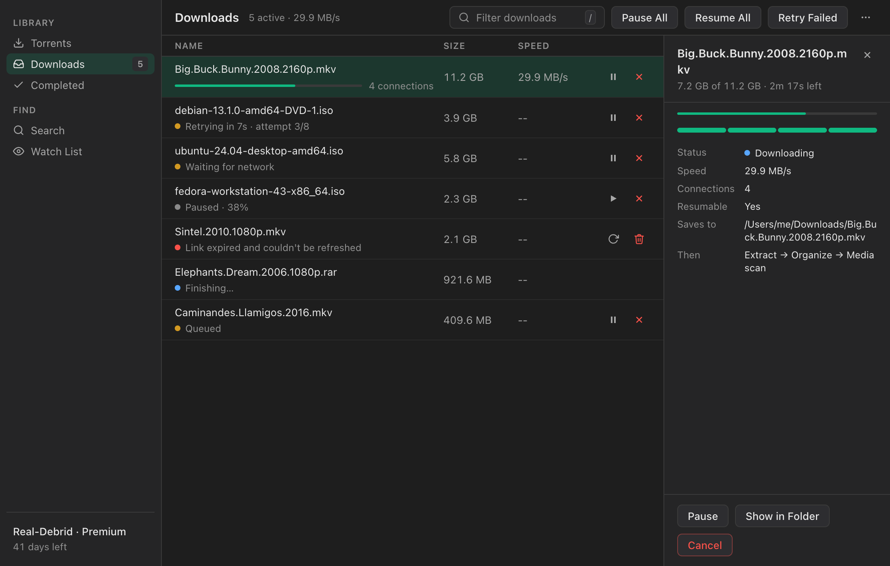

# DebridDownloader

A free, open-source desktop downloader for [Real-Debrid](https://real-debrid.com), [TorBox](https://torbox.app), and [Premiumize](https://premiumize.me). Resumable multi-connection downloads, a native interface in light or dark, and your tokens stay in your OS keychain.

[](https://github.com/CasaVargas/DebridDownloader/releases/latest)
[](https://github.com/CasaVargas/DebridDownloader/releases)
[](LICENSE)
[](https://discord.gg/SsDDexkhUx)

**[Download](https://casavargas.app/DebridDownloader/#download)** · **[Website](https://casavargas.app/DebridDownloader/)** · **[Release notes](https://github.com/CasaVargas/DebridDownloader/releases)**

<picture>
  <source media="(prefers-color-scheme: light)" srcset="docs/screens/downloads-light.png">
  
</picture>

## Features

**Downloads that don't start over**
- Multiple connections per file (4 by default, up to 16)
- Resumes after dropped connections, app restarts, and crashes
- Expired debrid links refresh automatically
- Pause, resume, and retry, for one download or all of them
- One app-wide speed limit and concurrent-download limit
- Waits for the network to come back instead of failing

**A native interface**
- Light, dark, or follow your system, with six accent colors
- The same clean layout on macOS, Windows, and Linux
- Keyboard shortcuts for everything common, with ⌘ on macOS and Ctrl elsewhere
- Closing the window keeps downloads running in the tray

**Everything around the download**
- Add magnets or `.torrent` files, pick files, and set it as your default magnet handler
- Search your own trackers: Torznab, Prowlarr, Jackett, TPB-style JSON APIs, and TorBox's built-in search, with a check for what's already cached
- A watch list that finds new releases and adds or notifies automatically
- Auto-extract archives and sort movies and shows into library folders (with TMDB lookups)
- Plex, Jellyfin, and Emby rescans when downloads finish
- rclone remotes as download destinations
- Plain-language error messages from your provider
- Tokens stored in macOS Keychain, Windows Credential Manager, or Secret Service
- Signed and notarized macOS builds, with in-app updates

## Download

| Platform | Build |
|---|---|
| macOS (Apple Silicon, macOS 11+) | `.dmg` |
| Windows 10+ (x64 and ARM64) | `.exe` installer |
| Linux (x64 and ARM64) | `.deb`, `.AppImage`, `.rpm` |

Get them from the [website](https://casavargas.app/DebridDownloader/#download) or the [latest release](https://github.com/CasaVargas/DebridDownloader/releases/latest). You'll need a Real-Debrid, TorBox, or Premiumize account.

## Getting started

1. Install and open DebridDownloader.
2. Connect your provider:
   - **Real-Debrid:** sign in with OAuth, or paste a token from [real-debrid.com/apitoken](https://real-debrid.com/apitoken)
   - **TorBox:** paste your API key from [torbox.app](https://torbox.app)
   - **Premiumize:** paste your API key from [premiumize.me/account](https://www.premiumize.me/account)
3. Add a torrent with <kbd>⌘</kbd>/<kbd>Ctrl</kbd> <kbd>N</kbd>, then download it once your provider has it ready.
4. Optional: add tracker sources in **Settings → Search** to search from inside the app.

### Keyboard shortcuts

<kbd>⌘</kbd> on macOS, <kbd>Ctrl</kbd> on Windows and Linux.

| Shortcut | Action |
|---|---|
| <kbd>⌘</kbd> <kbd>K</kbd> | Search |
| <kbd>⌘</kbd> <kbd>N</kbd> | Add a torrent |
| <kbd>⌘</kbd> <kbd>,</kbd> | Settings |
| <kbd>⌘</kbd> <kbd>R</kbd> | Refresh |
| <kbd>⌘</kbd> <kbd>I</kbd> | Show or hide the details panel |
| <kbd>1</kbd>–<kbd>4</kbd> | Torrents, Downloads, Completed, Watch List |
| <kbd>/</kbd> | Filter the current list |
| <kbd>↑</kbd> <kbd>↓</kbd> / <kbd>Enter</kbd> | Select / run the default action |
| <kbd>Space</kbd> | Pause or resume the selected download |
| <kbd>Delete</kbd> | Remove or cancel the selection |
| <kbd>Esc</kbd> | Close the panel or dialog |

## Legal

DebridDownloader is a download manager for paid debrid services. It:

- talks to the official [Real-Debrid](https://api.real-debrid.com/), [TorBox](https://api.torbox.app), and Premiumize APIs;
- ships with **no tracker sources**, so users add their own;
- does not host, index, or distribute any content;
- works like other download managers such as JDownloader or aria2.

It's a neutral tool. Users are responsible for how they use it and which sources they configure. The developers don't endorse or encourage piracy.

## Development

**Prerequisites:** [Node.js](https://nodejs.org) 22+ and [Rust](https://rustup.rs) stable.
- macOS: `xcode-select --install`
- Linux: `sudo apt install libwebkit2gtk-4.1-dev libappindicator3-dev librsvg2-dev patchelf`
- Windows: [WebView2](https://developer.microsoft.com/en-us/microsoft-edge/webview2/) (preinstalled on Windows 10/11)

```bash
git clone https://github.com/CasaVargas/DebridDownloader.git
cd DebridDownloader
npm install
npm run tauri dev        # app with hot reload
```

| Task | Command |
|---|---|
| Frontend tests (Vitest) | `npm test` |
| Rust tests (download engine) | `cargo test --manifest-path src-tauri/Cargo.toml` |
| Type check | `npx tsc --noEmit` |
| Production build | `npm run tauri build` |

Installers land in `src-tauri/target/release/bundle/`. CI runs the tests on every pull request.

### Architecture

A Tauri v2 app: a React 19 + TypeScript + Tailwind v4 frontend in `src/` talks to a Rust backend in `src-tauri/` over Tauri IPC.

| Path | What it is |
|---|---|
| `src-tauri/src/engine/` | The download engine. One actor owns every job; transfers write `{file}.part` with segmented `Range` requests and crash-safe checkpoints, persisted to `downloads.json`. No Tauri dependencies. |
| `src-tauri/src/engine_host.rs` | Connects the engine to Tauri: events, provider link refresh, rclone. |
| `src-tauri/src/providers/` | Real-Debrid, TorBox, and Premiumize clients behind one `DebridProvider` trait. |
| `src-tauri/src/commands/` | IPC command handlers. |
| `src-tauri/src/scrapers/` | Tracker search. |
| `src/styles/tokens.css` | Every color, size, and spacing value in one place. |
| `src/components/ui/` | Shared, accessible UI components. |
| `src/pages/` | One file per screen; Settings is split into `src/pages/settings/`. |

Design docs live in [`specs/`](specs/). [`AGENTS.md`](AGENTS.md) has the conventions for contributors.

## License

GPL-3.0. See [LICENSE](LICENSE).

## More from Casa Vargas

- **[Beltr](https://beltr.app):** AI karaoke for Windows, macOS, and Linux
- **[OneScribe](https://getonescribe.app):** an on-device document scanner for iOS
- **[casavargas.app](https://casavargas.app):** all projects
